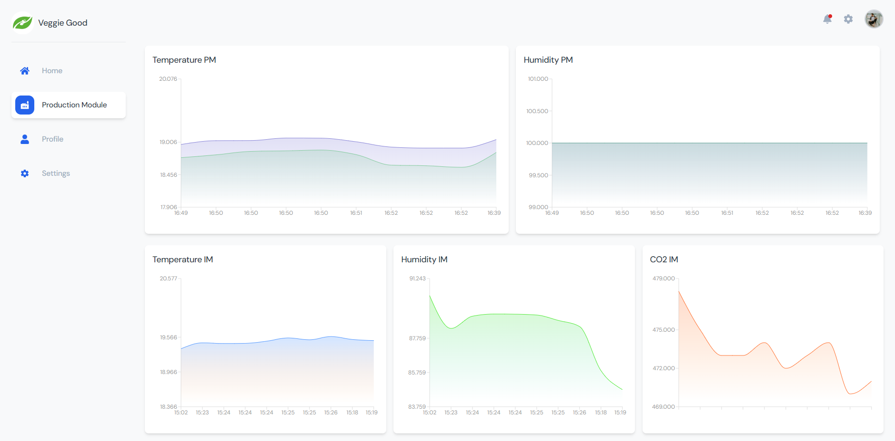
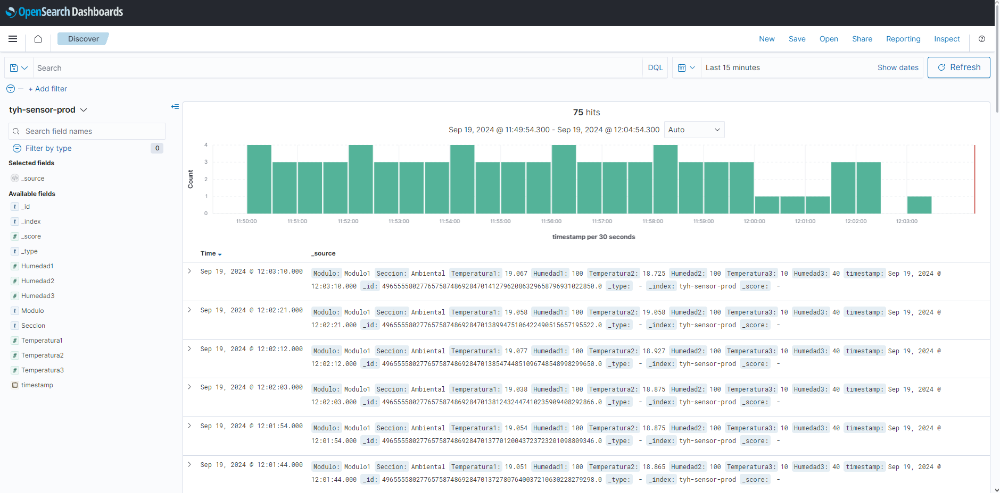

# VeggieGood

**VeggieGood** is the first version of a monitoring system for variables in a hydroponic farm. The application allows visualization and management of temperature and humidity sensor data obtained via Amazon OpenSearch. It is built using **Vite** as the bundler, **TypeScript** with **SWC** for compilation, and **Tailwind CSS** for styling. **React Icons** is used for iconography, and **Recharts** is utilized for data visualization.



## Technologies Used

- **Vite**: A fast and efficient bundler for modern web applications. Learn more in the [official documentation](https://vitejs.dev/).
- **TypeScript**: A superset of JavaScript that adds static typing. For details, visit the [TypeScript documentation](https://www.typescriptlang.org/).
- **SWC**: A super-fast JavaScript and TypeScript compiler. More information is available in the [GitHub repository](https://github.com/swc-project/swc).
- **Tailwind CSS**: A utility-first CSS framework for creating rapid and customizable designs. Check out the [Tailwind CSS documentation](https://tailwindcss.com/docs) for setup and usage.
- **React Icons**: A library providing a wide range of SVG icons for use in React projects. Visit the [React Icons documentation](https://react-icons.github.io/react-icons/) for usage and customization.
- **Recharts**: A chart library based on React for creating interactive and customizable charts. See the [Recharts documentation](https://recharts.org/en-US) for details on creating and configuring charts.
- **Amazon OpenSearch**: The data is ingested from Amazon OpenSearch, a real-time search and analytics service. For more information, refer to the [Amazon OpenSearch documentation](https://docs.aws.amazon.com/opensearch-service/latest/developerguide/what-is-amazon-opensearch-service.html).



## Project Structure

The project follows this structure:

```bash
.
├── public              # Static files
├── src
│   ├── components      # Application components
│   ├── pages           # Main pages
│   ├── styles          # Global styles
│   ├── App.tsx         # Main component
│   └── main.tsx        # Application entry point
├── tailwind.config.js  # Tailwind CSS configuration
├── tsconfig.json       # TypeScript configuration
├── vite.config.ts      # Vite configuration
└── package.json        # Dependencies and scripts
